# CRM-SLM Comparison POC — Technical Architecture

**Project:** 'CRM-SLM-Comparison'
**Purpose:** Compare a quantized base model, a Claude-teacher knowledge-distilled model, and a CRM-supervised model, while providing a Streamlit CRM assistant backed by local tools and retrieval.

This document describes the repository as it currently works. The older NextBestAction research pipeline and the newer conversational Streamlit pipeline are separate paths.

For the proposed modular redesign with reranking, retrieval metrics, durable sessions, context budgets, and LangSmith telemetry, see [CRM_SLM_RAG_AGENT_ARCHITECTURE.md](CRM_SLM_RAG_AGENT_ARCHITECTURE.md).

## 1. System at a glance

| System | Entry point | Output style | Main purpose |
|---|---|---|---|
| Research/training/evaluation | 'data_gen/', 'training/', 'eval/', 'report/' | Structured NextBestAction JSON | Measure Base vs KD vs SFT |
| Conversational Streamlit assistant | 'ui/app.py' | Natural-language CRM answer | Interactive CRM questions with tools and RAG |

The same local model registry supplies the model variants to both systems, but the prompts and runtime contracts differ.

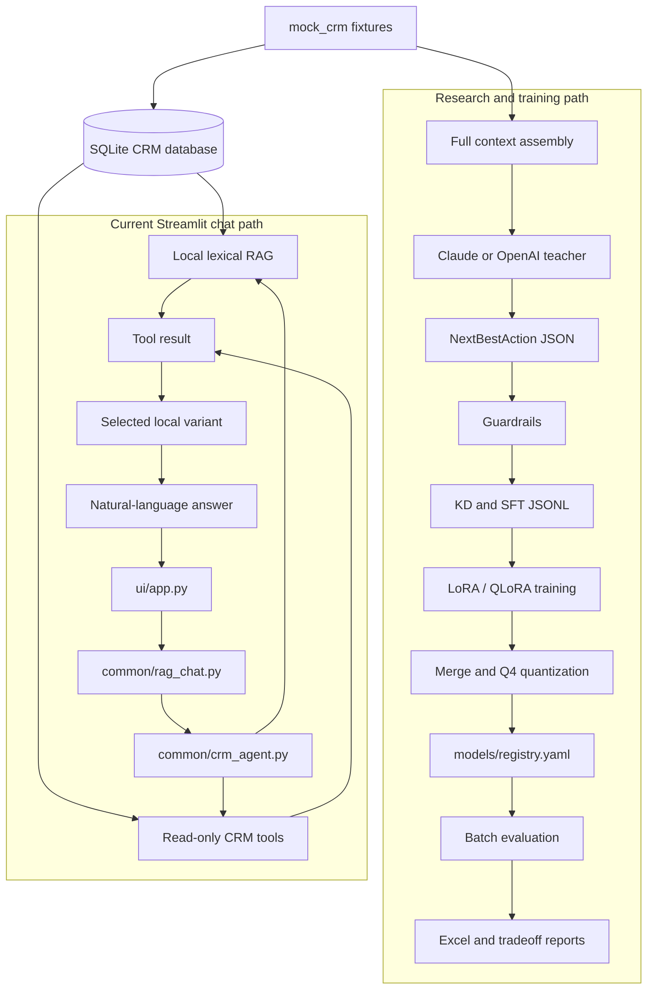

> Rendered SVG export is unavailable in the restricted environment; this Mermaid block renders in Mermaid-enabled Markdown viewers.

## 2. Repository layout

| Path | Responsibility |
|---|---|
| 'mock_crm/' | Source CRM fixtures: accounts, opportunities, emails, transcripts, playbooks, product catalog |
| 'data/' | Training, evaluation, manifests, compacted data, SQLite database |
| 'common/crm_store.py' | Builds and queries the local SQLite CRM database |
| 'common/context.py' | Full fixture-based context assembly for training and evaluation |
| 'common/context_compaction.py' | Token-aware compact context for training/evaluation |
| 'common/crm_retrieval.py' | Local lexical/BM25-style retrieval over structured CRM documents |
| 'common/crm_query.py' | Schema catalog, semantic QueryPlan validation, and parameterized read-only execution |
| 'common/crm_tools.py' | Thin compatibility adapter to the query service; contains no SQL router |
| 'common/crm_agent.py' | Tool-call planning, validation, execution, and retrieval trace |
| 'common/conversation_memory.py' | Session follow-up resolution and semantic conversation state |
| 'common/rag_chat.py' | Current conversational retrieval, model synthesis, and answer formatting |
| 'common/formatting.py' | NextBestAction prompts, parsing, repair, and context formatting |
| 'common/schemas.py' | Pydantic NextBestAction schema |
| 'models/inference.py' | Registry-driven local GGUF loading and generation |
| 'models/registry.yaml' | Single source of truth for Base, KD, and SFT model paths |
| 'data_gen/' | Claude teacher generation and SFT selection |
| 'training/' | Local/Colab LoRA training and adapter merge/quantization |
| 'eval/' | Batch generation, guardrails, performance tracking, Claude judge |
| 'report/' | Quantitative summaries, research report, Excel workbook |
| 'ui/app.py' | Main Streamlit chat and model comparison UI |
| 'ui/pages/' | Streamlit dataset browser |
| 'CONVERSATIONAL_AGENT_PLAN.md' | Planned next-generation natural conversational tool-use training |

## 3. CRM source data and database

### 3.1 Source fixtures

The current sample CRM contains four accounts:

- Acme Corp
- Globex Logistics
- Delta Freight & Warehousing
- Initech Solutions

```text
mock_crm/
├── accounts/*.json
├── opportunities/*.json
├── emails/*.md
├── transcripts/*.md
├── playbooks/*.md
└── product_catalog.json
```

### 3.2 SQLite schema

The database is generated at 'data/crm.sqlite3'. It is rebuilt from source fixtures when a source file is newer than the database.

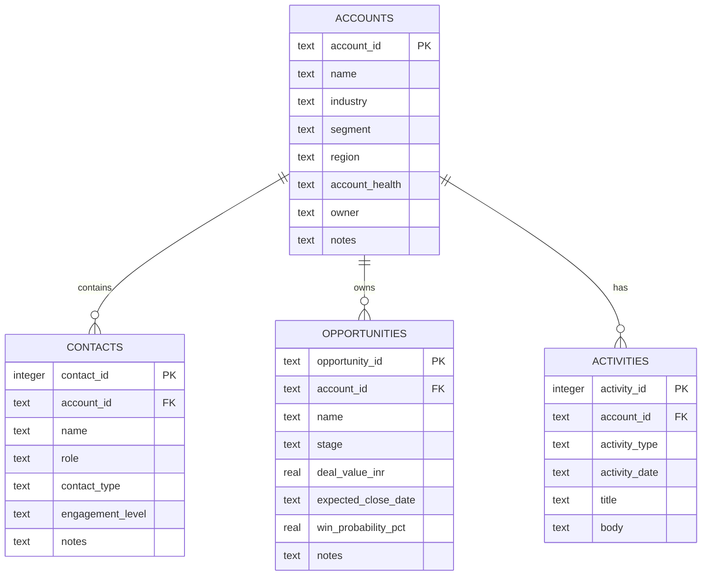


### 3.3 Database behavior

| Function | Behavior |
|---|---|
| 'build_database()' | Drops and rebuilds the four tables from fixture files |
| 'ensure_database()' | Rebuilds when source fixtures are newer |
| 'query_rows()' | Executes read-only SQL and returns dictionaries |
| 'database_snapshot()' | Returns account, opportunity, contact, and activity counts |

The current schema has **no leads table**. A lead question returns a clarification rather than inventing data.

Playbooks and the product catalog are not database tables. They remain global files used by the full-context training/evaluation path.

## 4. Current research and training pipeline

### 4.1 Data generation flow

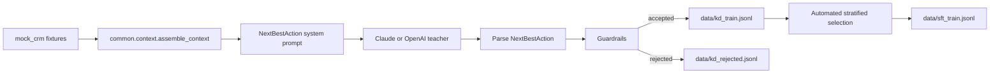


### 4.2 Current training target

The existing KD and SFT models were trained to produce this schema:

```json
{
  "action_type": "escalate_internal",
  "target_object": "opp_acme_corp_001",
  "payload": {},
  "rationale": "Reason based on CRM evidence.",
  "risk_flags": ["economic_buyer_disengagement"],
  "confidence": 0.85
}
```

This means the current adapters are optimized for structured NextBestAction generation, not full conversational tool use.

### 4.3 Training data

| Dataset | Current role | Current size | Target format |
|---|---|---:|---|
| 'data/kd_train.jsonl' | Claude/teacher demonstrations | 44 accepted rows in current manifest | NextBestAction JSON |
| 'data/sft_train.jsonl' | Automated account-stratified subset | 31 rows in current manifest | NextBestAction JSON |
| 'data/eval_set.jsonl' | Held-out evaluation queries | 20 queries | NextBestAction requests |
| 'data/kd_train_compacted.jsonl' | Context-compacted training copy | Generated | Same target, smaller context |

The current SFT selection is automated, not human reviewed. The manifest records this explicitly.

### 4.4 Local training flow

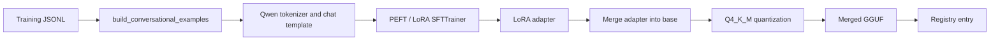


The training script is parameterized by dataset path, adapter output path, maximum sequence length, compact-context budget, and training hyperparameters.

The project switched from Qwen3-4B to Qwen3-1.7B because the available constrained GPU could not train the longer-context 4B configuration reliably.

### 4.5 Model registry

| Variant | Meaning | Current GGUF |
|---|---|---|
| 'base' | No fine-tuning | 'models/Qwen3-1.7B-Q4_K_M.gguf' |
| 'kd' | Claude teacher demonstrations | 'adapters/kd/merged-Q4_K_M.gguf' |
| 'sft' | Curated/selected CRM examples | 'adapters/sft/merged-Q4_K_M.gguf' |

Shared inference settings:

| Setting | Current value |
|---|---:|
| Context size | 5120 |
| GPU layers | All available |
| Quantized KV cache | Enabled |
| KQV offload | Enabled |
| Runtime | llama.cpp through 'models/inference.py' |

Only one model is loaded at a time during comparison because of the 4 GB GPU constraint.

## 5. NextBestAction evaluation pipeline

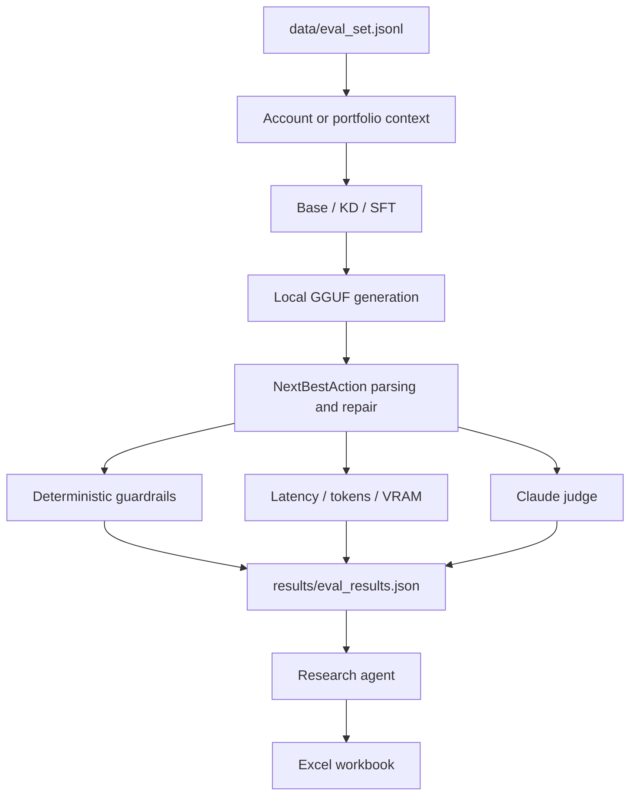


### 5.1 Guardrails

| Check | Meaning |
|---|---|
| Discount ceiling | Customer discount asks must respect policy thresholds |
| Direct CRM writes | Disallowed direct CRM state changes are rejected |
| Risk surfacing | Evidence-backed risks must appear in rationale or risk flags |
| Parse validity | Response must conform to the NextBestAction schema |

These are evaluation checks for the old structured pipeline. They are not the runtime contract for the natural-language Streamlit assistant.

### 5.2 Claude judge

| Score | Meaning |
|---|---|
| Correctness | Whether the response is factually supported |
| Completeness | Whether it answers the question and covers important facts |
| Risk surfacing | Whether relevant CRM risks are identified |

The judge is a quality evaluator. It does not execute CRM actions and is not the same as a guardrail.

## 6. Current Streamlit conversational flow

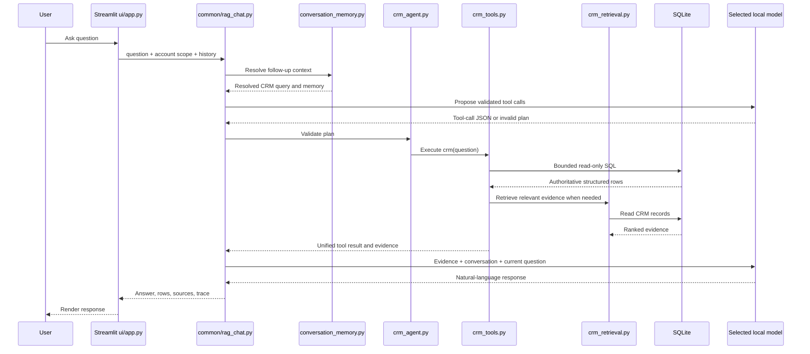

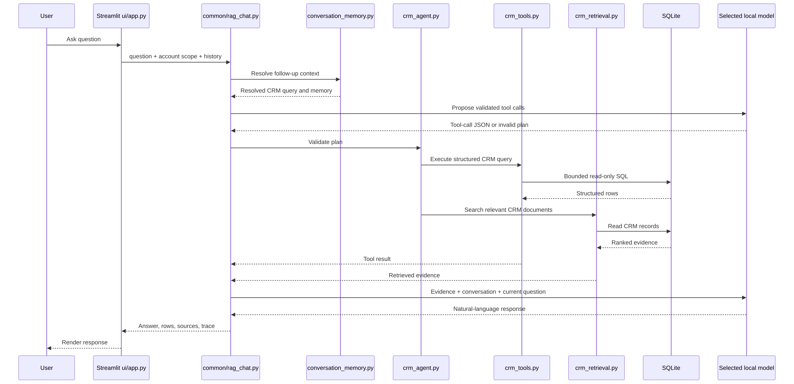

### 6.1 Streamlit components

| Component | Responsibility |
|---|---|
| 'ui/app.py' | Chat history, account scope, model selection, comparison mode, rendering |
| 'common/rag_chat.py' | Model loading, retrieval, synthesis, answer cleanup |
| 'common/conversation_memory.py' | Subject, intent, account, and follow-up resolution |
| 'common/crm_agent.py' | Tool definitions, validation, execution, retrieval trace |
| 'common/crm_query.py' | Bounded SQL-backed CRM lookups from validated semantic plans |
| 'common/crm_retrieval.py' | Lexical document retrieval |
| 'models/inference.py' | Loads the selected GGUF variant |

### 6.2 Current retrieval architecture

The current chat pipeline does not send the entire CRM context on every turn. It combines:

1. A structured SQL tool result.
2. Top-ranked local retrieval hits.
3. Recent conversation history.
4. The current question.

The structured result is authoritative for counts and exact values. RAG documents provide supporting evidence from accounts, opportunities, emails, and transcripts.

### 6.3 Current RAG implementation

'common/crm_retrieval.py' creates searchable documents from account rows, opportunity rows, and activity rows.

Ranking uses a dependency-light BM25-style lexical score with:

- token overlap
- inverse document frequency
- title matches
- document-type boosts
- opportunity boosts for deal/pipeline questions
- activity boosts for risk/recent/customer questions
- date boost

The implementation is local and deterministic. It does not require a vector database or embedding model.

### 6.4 Current unified CRM tool

The model sees one read-only tool: `crm(question, plan)`. The plan is semantic,
never SQL. It identifies an entity, operation, filters, and requested fields.
The application validates the plan against the schema catalog, executes only
allow-listed parameterized queries, and attaches bounded lexical evidence when
the question needs email, transcript, or narrative support. The internal
result names below are compatibility labels; they are not separate model tools.

```mermaid
flowchart LR
    MODEL[Base / KD / SFT model]
    TOOL[crm(question, plan)]
    CATALOG[Schema catalog]
    VALIDATE[QueryPlan validator]
    EXEC[Read-only SQL executor]
    DB[(CRM SQLite)]
    EVIDENCE[Lexical evidence service]
    RESULT[Unified structured result]
    MODEL --> TOOL --> VALIDATE
    CATALOG --> VALIDATE
    VALIDATE --> EXEC --> DB --> RESULT
    TOOL --> EVIDENCE --> RESULT
    RESULT --> MODEL
```

The structured result is authoritative for counts, aggregates, ownership, and
other database fields. Evidence retrieval supports narrative questions; it is
not used to estimate database totals.

| Internal result name | Typical questions |
|---|---|
| 'count_accounts' | How many accounts? |
| 'count_contacts' | How many contacts? |
| 'count_opportunities' | How many deals? |
| 'count_emails' | How many emails? |
| 'account_ownership' | Who owns or is responsible for an account? |
| 'risk_summary' | Which accounts are at risk? |
| 'risk_by_account' | What is the risk for this account? |
| 'accounts_all' | List accounts |
| 'contacts_all' | List contacts |
| 'contacts_by_account' | Contacts at an account |
| 'opportunities_all' | List opportunities |
| 'pipeline_summary' | Pipeline by stage |
| 'revenue_by_account' | Deal value for an account |
| 'revenue_portfolio' | Total portfolio value |
| 'win_probability' | Forecast and win probability |
| 'close_dates' | Expected close dates |
| 'account_summary' | Basic account summary |
| 'portfolio_overview' | Generic portfolio overview |
| 'schema_clarification' | Unsupported entities such as leads |

All current tools are read-only.

### 6.5 Current conversation memory

The UI stores messages in the active Streamlit conversation. The memory layer derives:

| Memory field | Purpose |
|---|---|
| Last user question | Previous-turn reference |
| Subject | Contacts, accounts, opportunities, risks, activities |
| Account ID | Account continuity |
| Intent | Count, list, explain, recommend, lookup |

Example:

```text
User: How many contacts are there?
Assistant: There are 12 contacts.
User: Which are they?
Resolved query: list contacts across the portfolio
```

This is application-level memory. The models do not retain memory independently; history is passed into each turn.

## 7. Streamlit UI

### 7.1 Main page

The main page supports:

- account scope selection
- portfolio-wide scope
- Base/KD/SFT selection
- side-by-side comparison
- persistent conversations
- structured data expander
- retrieval steps expander
- source documents expander
- optional Claude judge score

### 7.2 Dataset Browser

The Dataset Browser exposes:

- account profiles
- contacts
- opportunity metrics
- risk factors
- line items where available
- emails
- call transcripts
- playbooks
- product catalog

It uses the same CRM fixture source as the training/evaluation context assembly.

### 7.3 VRAM behavior

When multiple variants are selected, the UI runs them sequentially:

```text
load Base -> generate -> close Base
load KD -> generate -> close KD
load SFT -> generate -> close SFT
```

This prevents all GGUF models from remaining resident on the constrained GPU.

## 8. Context paths

| Path | Context strategy |
|---|---|
| Old teacher/training pipeline | Full account or portfolio context, optionally compacted |
| Old NextBestAction evaluation | Full/compacted context plus structured schema prompt |
| Current Streamlit chat | Structured tool result plus top lexical retrieval hits |
| Dataset Browser | Direct fixture rendering for inspection |

The current chat UI should not be described as using the same full context as the old training pipeline. It uses a smaller evidence packet assembled per question.

## 9. Planned conversational-agent architecture

The goal is for each local model itself to understand casual messages, CRM intent, follow-ups, tool selection, tool arguments, tool results, and natural final answers.

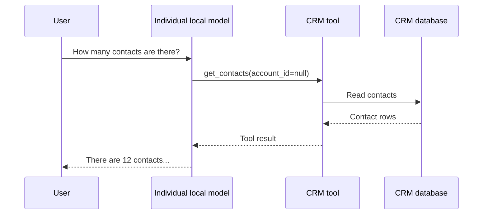

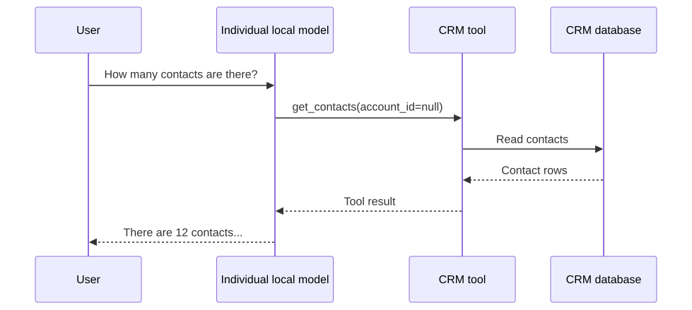

The old NextBestAction dataset should not be reused as the target for this agent behavior. New conversational KD and SFT datasets should be generated with Claude and trained into separate adapters.

## 10. Main commands

### Compile and smoke test

```bash
cd ~/Magna/CRM-SLM-Comparison

/home/dsp-at-magna/Magna/venv-gpu/bin/python -m py_compile \
  common/*.py data_gen/*.py eval/*.py models/*.py report/*.py training/*.py ui/app.py
```

### Train an adapter

```bash
/home/dsp-at-magna/Magna/venv-gpu/bin/python training/train_lora.py \
  --dataset data/kd_train.jsonl \
  --adapter-out adapters/kd-local \
  --max-seq-length 1024
```

### Evaluate and build report

```bash
/home/dsp-at-magna/Magna/venv-gpu/bin/python -m eval.run_eval
/home/dsp-at-magna/Magna/venv-gpu/bin/python -m report.research_agent
/home/dsp-at-magna/Magna/venv-gpu/bin/python -m report.build_excel
```

### Run Streamlit

```bash
cd ~/Magna/CRM-SLM-Comparison

/home/dsp-at-magna/Magna/venv-gpu/bin/python -m streamlit run ui/app.py --server.port 8502
```

### Inspect with Ripwire

```bash
cd ~/Magna/CRM-SLM-Comparison

ripwire . --report
ripwire . --for="conversational CRM agent tool calling training"
```

## 11. Important boundaries and risks

| Area | Current limitation |
|---|---|
| Model behavior | Existing KD/SFT adapters were trained for NextBestAction JSON, not full conversational tool use |
| Tool planning | Current chat planner uses validated JSON planning with deterministic fallback; it is not native function calling |
| Retrieval | Current RAG is lexical, not embedding/vector-based |
| Memory | Session history is passed by the application; models do not retain memory independently |
| CRM writes | Tools are read-only; no CRM update is executed |
| Data volume | Current training sets are small for broad agent behavior |
| Evaluation | Existing guardrails evaluate NextBestAction output, not natural conversational tool use |
| Account generalization | The old evaluation trained on all four accounts, so Delta is not a true unseen-account test |
| UI validation | Streamlit logic has been tested, but visual browser QA may still be needed |
| Source of truth | Fixture files are the source; production CRM connectors are not connected |

## 12. Recommended next implementation boundary

```text
common/agent_tools.py
    tool schemas and validated execution

data_gen/generate_chat_teacher.py
    Claude-generated conversational tool-use examples

training/train_chat_lora.py
    conversational KD/SFT training

models/registry.yaml
    chat_base, chat_kd, chat_sft entries

common/local_tool_agent.py
    per-model tool-call -> tool result -> natural answer loop

ui/
    Conversational Agent mode
    NextBestAction Research mode
```

This keeps the proven NextBestAction experiment reproducible while allowing the new conversational agent to evolve without mixing output contracts.

## 13. One-sentence architecture summary

The project is a registry-driven local Qwen model comparison system with a fixture-backed SQLite CRM, deterministic structured tools, lexical RAG, a Streamlit conversational layer, and a separate Claude-teacher/LoRA/guardrail/evaluation pipeline for NextBestAction research.
